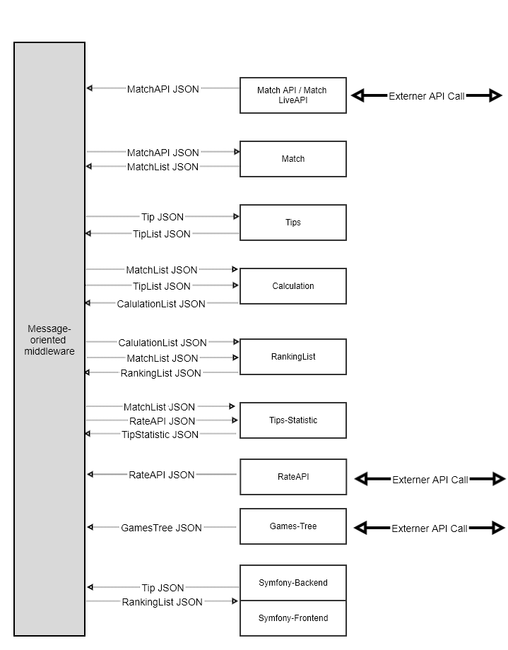

# documentation for microservice

### Data flows:




### Json Example:

##### MatchAPI JSON / Match LiveAPI JSON
```
{
    "matchId": "2020-06-16-21:00-FR-DE",
    "team1" : "FR",
    "team2" : "DE",
    "matchDatetime": "2020-06-16 21:00",
    "scoreTeam1": null,
    "scoreTeam2": null,
}
```

or with score

```
{
    "matchId": "2020-06-16-21:00-FR-DE",
    "team1" : "FR",
    "team2" : "DE",
    "matchDatetime": "2020-06-16 21:00",
    "scoreTeam1": 1,
    "scoreTeam2": 4,
}
```

##### MatchList JSON

```
[
    {
        "matchId": "2020-06-16-21:00-FR-DE",
        "team1" : "FR",
        "team2" : "DE",
        "matchDatetime": "2020-06-16 21:00",
        "scoreTeam1": 1,
        "scoreTeam2": 4,
    },
    {
        "matchId": "2020-06-20-18:00-PT-DE",
        "team1" : "PT",
        "team2" : "DE",
        "matchDatetime": "2020-06-20 18:00",
        "scoreTeam1": null,
        "scoreTeam2": null,
    }
    ...
]
```

##### Tips

###### Recieve - Tip JSON

```
{
    "matchId": "2020-06-16-21:00-FR-DE",
    "user" : "ninja",
    "tipDatetime": "2020-06-12 14:36",
    "tipTeam1": 2,
    "tipTeam2": 3,
}
```

###### Send - TipList JSON
```
[
    {
        "matchId": "2020-06-16-21:00-FR-DE",
        "user" : "ninja",
        "tipDatetime": "2020-06-12 14:36",
        "tipTeam1": 2,
        "tipTeam2": 3,
    },
    {
        "matchId": "2020-06-20-18:00-PT-DE",
        "user" : "ninja",
        "tipDatetime": "2020-06-12 14:37",
        "tipTeam1": 4,
        "tipTeam2": 2,
    }
]
```

##### CalculationList JSON

```
[
    {
        "matchId": "2020-06-16-21:00-FR-DE",
        "user" : "ninja",
        "score": 4,
        "tipTeam1": 2,
        "tipTeam2": 3,
    },
    {
        "matchId": "2020-06-20-18:00-PT-DE",
        "user" : "ninja",
        "score": null,
        "tipTeam1": 4,
        "tipTeam2": 2,
    }
]
```

##### RankingList JSON

```
{
    "games" : [{
            "matchId": "2020-06-16-21:00-FR-DE",
            "team1" : "FR",
            "team2" : "DE",
            "matchDatetime": "2020-06-16 21:00",
            "scoreTeam1": 1,
            "scoreTeam2": 4,
        },
        {
            "matchId": "2020-06-20-18:00-PT-DE",
            "team1" : "PT",
            "team2" : "DE",
            "matchDatetime": "2020-06-20 18:00",
            "scoreTeam1": null,
            "scoreTeam2": null,
        }
        ...
    ],
    "users" : [
        {
            "name" : "ninja",
            "position" : 1,
            "scoreSum" : 24,
            "tips" : [
                {
                    "matchId": "2020-06-16-21:00-FR-DE",
                    "score": 4,
                    "tipTeam1": 2,
                    "tipTeam2": 3,
                },
                {
                    "matchId": "2020-06-20-18:00-PT-DE",
                    "score": null,
                    "tipTeam1": 4,
                    "tipTeam2": 2,
                }
            ]
        }
    ]
}
```

##### RateAPI JSON

```
{
    "matchId": "2020-06-16-21:00-FR-DE",
    "quotaTeam1" 5,
    "quotaTeam2" 1,
}
```

##### Tips-Statistic

```
[
    {
        "matchId": "2020-06-16-21:00-FR-DE",
        "quotaTeam1" 5,
        "quotaTeam2" 1,
        TBD
    }
]
```

##### GamesTree

```
{
    #matchId format =  "2020-06-16-21:00-FR-DE"
    TBD
}
```


#### Programm

[Chrome-Extenstion Gliffy](https://chrome.google.com/webstore/detail/gliffy-diagrams/bhmicilclplefnflapjmnngmkkkkpfad?utm_source=chrome-app-launcher-info-dialog)

File: [./data-flows.gliffy](https://raw.githubusercontent.com/football-betting/documentation/master/data-flows.gliffy)
